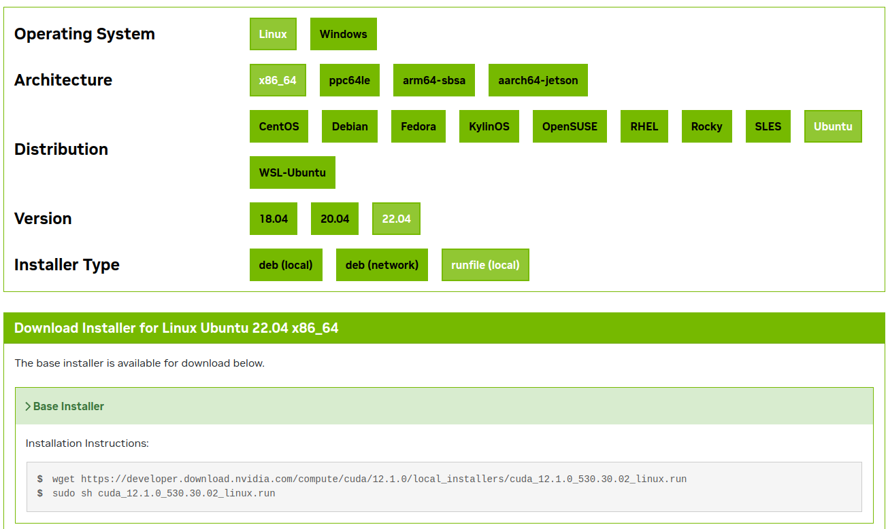
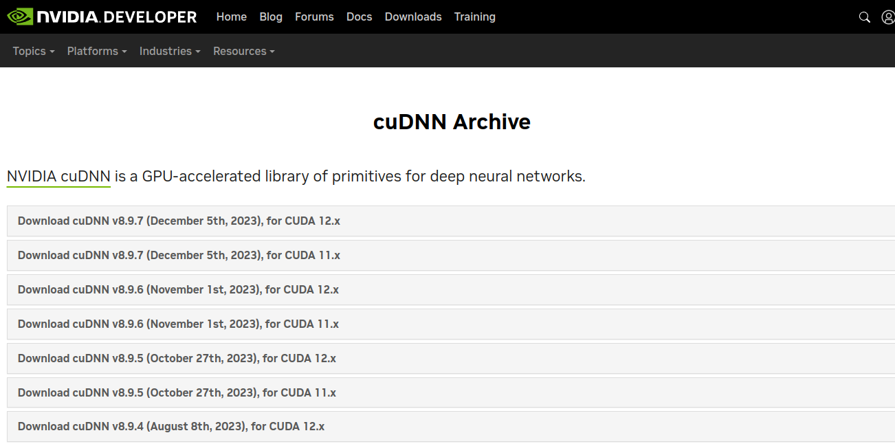
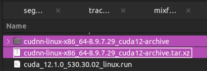

# CUDA Setup Guideline

## Dowload CUDA Installer
CUDA Installer [Download Link](https://developer.nvidia.com/cuda-toolkit-archive)

### Check Architecture
```console
user@admin1:~$ uname -m
x86_64
```

### Check Distribution and Version
```console
user@admin1:~$ lsb_release -a
No LSB modules are available.
Distributor ID:	Ubuntu
Description:	Ubuntu 22.04.4 LTS
Release:	22.04
Codename:	jammy
```

### Download cuda_installer.run
* It's better to install the `*.run` file
    

    ```console
    user@admin1:~/Downloads$ wget https://developer.download.nvidia.com/compute/cuda/12.1.0/local_installers/cuda_12.1.0_530.30.02_linux.run
    ```

### Install cuda_installer.run
```console
user@admin1:~/Downloads$ sudo sh cuda_12.1.0_530.30.02_linux.run --silent --toolkit --toolkitpath=/usr/local/cuda-12.1
```

* ```--silent```<br>
This will force installer to do everything in a silence without any user-interaction.

* ```--toolkit```<br>
Install only the toolkit, no drivers, samples, documentation etc

* ```--toolkitpath```<br>
By default, it will install into the folder /usr/local/cuda-xx.x according to the version, but if you wish to install into a different folder you can specify it here. I have explicitly given it the default path just for demonstration.

**IMPORTANT:** The installer creates a symbolic link `/usr/local/cuda` that points to the actual installation folder `/usr/local/cuda-12.1`. The previous version of CUDA that stored in the symbolic link `/usr/local/cuda` will be replaced by `/usr/local/cuda-12.1`.

## Download the cuDNN package
cuDNN package [Download Link](https://developer.nvidia.com/rdp/cudnn-archive)

* Select the latest `cuDNN v8.9.7 (December 5th, 2023), for CUDA 12.x` (Tar) package, since our CUDA Installer is `CUDA 12.1`

    

### Extract files from the tar file
```console
user@admin1:~/Downloads$ tar -xvf cudnn-linux-x86_64-8.9.7.29_cuda12-archive.tar.xz
```


### Copy cuDNN files to CUDA toolkit directory
```console
user@admin1:~/Downloads$ cd cudnn-linux-x86_64-8.9.7.29_cuda12-archive ### Get into the directory
user@admin1:~/Downloads/cudnn-linux-x86_64-8.9.7.29_cuda12-archive$ sudo cp -P include/cudnn*.h /usr/local/cuda-12.1/include ### # Copy include files
user@admin1:~/Downloads/cudnn-linux-x86_64-8.9.7.29_cuda12-archive$ sudo cp -P lib/libcudnn* /usr/local/cuda-12.1/lib64 ### Copy lib files (it could be lib or lib64)
```
```console
user@admin1:~/Downloads$ sudo chmod a+r /usr/local/cuda-12.1/include/cudnn*.h ### Set read permissions of files for all users
user@admin1:~/Downloads$ sudo chmod a+r /usr/local/cuda-12.1/lib64/libcudnn* ### Set read permissions of files for all users
```

## Update Environment Variables
* update the `.bashrc or .bash_profile or .zshrc or .profile` hidden file<br>
    ```console
    user@admin1:~/home$ nano ~/.bashrc
    ```

    ```
    #.bashrc
    ### Append this 3 line at the bottom of the `.bashrc`

    export PATH=/usr/local/cuda/bin:$PATH
    export CUDA_HOME=/usr/local/cuda
    export LD_LIBRARY_PATH=/usr/local/cuda/lib64:$LD_LIBRARY_PATH
    ```

## Version Control of CUDA
* `update-alternatives` command can help for managing symbolic links
    ```console
    user@admin1:~$ sudo apt-get install update-alternatives ### Install package
    ```
* Check current status, `update-alternatives --display <name>`
    ```console
    user@admin1:~$ sudo update-alternatives --display cuda
    cuda - manual mode
        link best version is /usr/local/cuda-11.7
        link currently points to /usr/local/cuda-12.6
        link cuda is /usr/local/cuda
    /usr/local/cuda-11.7 - priority 11
    /usr/local/cuda-12.6 - priority 9
    ```
* Add new link, `update-alternatives --install <link> <name> <path> <priority>`
    ```console
    user@admin1:~$ sudo update-alternatives --install /usr/local/cuda cuda /usr/local/cuda-12.1 10
    ```
    * **\<link>** : Symbolic link --> /usr/local/cuda

    * **\<name>** : Name of symbolic link --> cuda

    * **\<path>** : Installation path of `cuda-12.1` --> /usr/local/cuda-12.1

    * **\<priority>** : Selection priority rank --> 10

* Select CUDA version, `update-alternatives --config <name>`
    ```console
    user@admin1:~$ sudo update-alternatives --config cuda
    There are 3 choices for the alternative cuda (providing /usr/local/cuda).

      Selection    Path                   Priority   Status
      ------------------------------------------------------------
      0            /usr/local/cuda-11.7   11         auto mode
      1            /usr/local/cuda-11.7   11         manual mode
      2            /usr/local/cuda-12.1   10         manual mode
    * 3            /usr/local/cuda-12.6   9          manual mode

    Press <enter> to keep the current choice[*], or type selection number: 
    ```

* Verify the CUDA version, `nvcc --version`
    ```console
    user@admin1:~$ nvcc -V
    nvcc: NVIDIA (R) Cuda compiler driver
    Copyright (c) 2005-2023 NVIDIA Corporation
    Built on Tue_Feb__7_19:32:13_PST_2023
    Cuda compilation tools, release 12.1, V12.1.66
    Build cuda_12.1.r12.1/compiler.32415258_0
    ```

* Removing An Alternative, `sudo update-alternatives --remove <name> <path>`
    ```console
    user@admin1:~$ update-alternatives --list cuda ### List all cuda alternatives
    user@admin1:~$ sudo update-alternatives --remove cuda /usr/local/cuda-11.7 ### Remove an alternative
    ```
